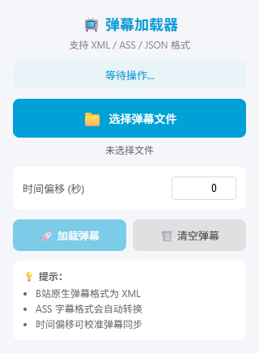
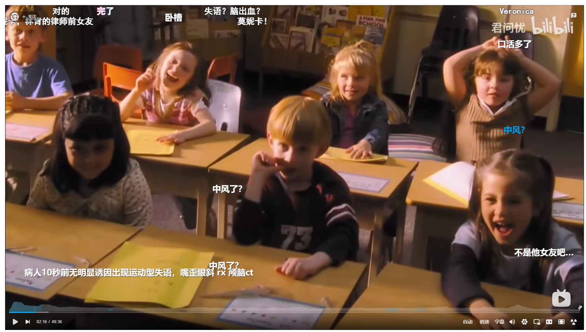

# 🎬 Danmaku Loader

> 一个 Chrome 扩展，将本地弹幕文件注入到任意视频播放器中。

[](https://developer.chrome.com/docs/extensions/)
[](LICENSE)

**Danmaku Loader** 让你可以把下载好的弹幕文件（XML / ASS / JSON / TXT）加载到视频网站上，和原平台弹幕一起播放。目前支持 Bilibili，架构设计支持未来扩展到 YouTube、腾讯视频等任意平台。





---

## ✨ 功能特性

- 📁 **多格式支持** — XML（B站原生）、ASS/SSA 字幕、JSON、TXT
- ⏱️ **时间偏移** — 微调弹幕时间轴，解决片头片尾差异导致的不同步
- 🔄 **双模式注入** — 优先调用播放器原生弹幕 API，失败时自动回退到自建弹幕层
- ⏸️ **播放同步** — 弹幕严格跟随视频进度：暂停时不出新弹幕，拖动进度条自动定位
- 🧩 **多平台架构** — 插件化适配器设计，新增平台只需实现一个 Adapter 类

---

## 🚀 快速开始

### 安装（开发者模式）

1. 下载本仓库并解压
2. 打开 Chrome，地址栏输入 `chrome://extensions/`
3. 开启右上角 **「开发者模式」**
4. 点击 **「加载已解压的扩展程序」**
5. 选择本项目文件夹

### 获取弹幕文件

如果你手头上没有弹幕文件，推荐到 [**弹幕保存计划**](https://danmubox.github.io/) 获取：

- 这是一个专注于弹幕收集整理、资源求助和技术交流的社区项目
- 你可以在 [**弹幕保存计划吧**](https://tieba.baidu.com/f?kw=%E5%BC%B9%E5%B9%95%E4%BF%9D%E5%AD%98%E8%AE%A1%E5%88%92) 或 QQ 群（495877205）求助获取弹幕资源
- 网站还提供了辅助工具，如修复 B 站失效收藏的 Tampermonkey 脚本

### 使用

1. 打开任意支持的视频页面（如 [Bilibili](https://www.bilibili.com)）
2. 点击浏览器工具栏上的扩展图标
3. 选择本地的弹幕文件（从 [弹幕保存计划](https://danmubox.github.io/) 下载的 XML 格式即可直接导入）
4. 点击 **「🚀 加载弹幕」**

> 💡 如果弹幕和视频不同步，在弹窗中调整「时间偏移（秒）」后再加载。

---

## 📋 支持情况

| 平台 | 域名 | 原生注入 | 自建弹幕层 | 状态 |
|------|------|----------|------------|------|
| **Bilibili** | `bilibili.com` | ✅ (部分) | ✅ | 已支持 |
| YouTube | `youtube.com` | — | 🔮 | 计划中 |
| 腾讯视频 | `v.qq.com` | — | 🔮 | 计划中 |
| 爱奇艺 | `iqiyi.com` | — | 🔮 | 计划中 |

> Bilibili 新版播放器（bpx-player）未开放本地弹幕注入 API，目前通过自建弹幕层实现，效果与原生弹幕基本一致。

> 🔮 表示可通过自建弹幕层支持（无需平台开放 API）。欢迎 PR 添加新平台！

---

## 📄 支持的弹幕格式

### XML（Bilibili 原生）

```xml
<?xml version="1.0" encoding="UTF-8"?>
<i>
  <d p="1.234,1,25,16777215,0,0,uid,123">弹幕内容</d>
  <d p="5.678,4,25,16777215,0,0,uid,124">底部弹幕</d>
</i>
```

属性 `p` 的格式：`时间(秒),类型,字号,颜色,时间戳,弹幕池,用户ID,rowId`

### ASS / SSA 字幕

标准字幕文件会自动转换为弹幕显示，保留时间轴和基础样式。

### JSON

```json
[
  { "text": "弹幕内容", "time": 1.234, "mode": 1, "size": 25, "color": 16777215 },
  { "text": "第二条", "time": 5.678, "mode": 4, "size": 25, "color": 16777215 }
]
```

### TXT

```
1.234,第一条弹幕
5.678,第二条弹幕
```

---

## 🏗️ 项目架构

```
danmaku-loader/
├── manifest.json              # Chrome Extension Manifest V3
├── popup.html / popup.css / popup.js   # 扩展弹窗 UI
├── content.js                 # 内容脚本：隔离上下文 ↔ 页面通信桥
├── src/
│   ├── danmaku-parser.js      # 弹幕文件解析器
│   ├── danmaku-renderer.js    # 通用弹幕渲染引擎（视频时间同步）
│   ├── player-adapters.js     # 播放器适配器体系（基类 + 注册表）
│   └── injector.js            # 页面注入入口：调度适配器与渲染器
└── images/
```

### 核心设计：适配器模式

每个视频平台实现一个 `PlayerAdapter`：

```javascript
class BilibiliAdapter extends BaseAdapter {
  static match(hostname) {
    return hostname.includes('bilibili.com');
  }

  getPlayer() {
    // 探测平台播放器实例
    return window.player || window.bpxPlayer;
  }

  injectDanmaku(danmakus) {
    // 调用平台原生弹幕 API
  }
}
```

**新增一个平台的成本 ≈ 50 行代码。**

---

## 🔧 开发指南

### 添加新视频平台

1. 在 `src/player-adapters.js` 中继承 `BaseAdapter`：

```javascript
class YouTubeAdapter extends BaseAdapter {
  static match(hostname) {
    return hostname.includes('youtube.com');
  }

  getVideoElement() {
    return document.querySelector('video');
  }

  getPlayerContainer() {
    return document.querySelector('#movie_player') || this.getVideoElement()?.parentElement;
  }

  supportsNativeInjection() {
    return false; // YouTube 没有开放弹幕 API
  }
}
```

2. 注册到适配器注册表：

```javascript
PlayerAdapters.registry.register(YouTubeAdapter);
```

3. 在 `manifest.json` 中添加目标域名：

```json
"content_scripts": [{
  "matches": ["*://www.bilibili.com/video/*", "*://www.youtube.com/watch*"]
}],
"host_permissions": ["*://www.bilibili.com/*", "*://www.youtube.com/*"]
```

4. 刷新扩展即可生效。

---

## 🔬 技术原理

### 为什么需要三层通信？

Chrome Extension 的 Content Script 运行在**独立的 JavaScript 沙箱**中，无法直接访问页面主上下文（如 `window.player`）。

```
Popup (扩展弹窗)
  ↓ chrome.tabs.sendMessage
Content Script (隔离上下文)
  ↓ window.postMessage
Injector Script (页面主上下文)
  ↓ 直接调用 window.player
Video Player
```

### 弹幕同步机制

自建弹幕层不依赖 `setTimeout`，而是通过 `requestAnimationFrame` 每帧轮询 `video.currentTime`：

- **播放中**：显示当前时间窗口内的弹幕
- **暂停时**：`currentTime` 不变，不发送新弹幕
- **Seek 时**：清空屏幕，重新定位弹幕索引

---

## 📦 发布到 Chrome Web Store（计划）

- [ ] 准备商店截图和描述
- [ ] 打包扩展为 `.zip`
- [ ] 提交审核

---

## 📜 License

[MIT](LICENSE) © 2025

---

## 🙏 致谢

- 弹幕解析逻辑参考 Bilibili 官方 XML 格式
- 图标使用 Python 标准库生成

> 如果这个项目对你有帮助，请给个 ⭐️ Star！
